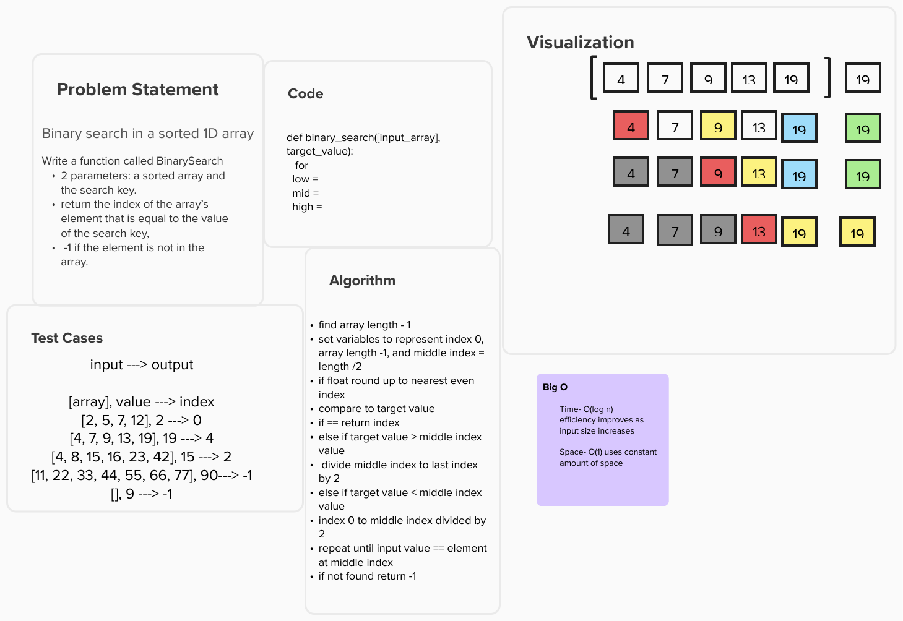

# Challenge Title

Binaray Search

## Whiteboard Process

## Approach & Efficiency
<!-- What approach did you take? Why? What is the Big O space/time for this approach? -->
Created variable to represent the indices of low(0), the middle, and high based on the length of the array. Then compare the value of the middle index to the target value argument. If it is equal then that index will be returned. If the target value is greater than the value of the middle index, the middle index varible will change to low variable. and a loop will find the new middle index and compare it to the target value until it is equal. If the target value is less than the value of the middle index, the middle index varible will change to the high variable. and a loop will find the new middle index and compare it to the target value. this will continue until it is equal. If it is never equal return -1

Time- O(log n)
efficiency improves as input size increases

Space- O(1) uses constant amount of space

## Solution

Haven't finished the solution
